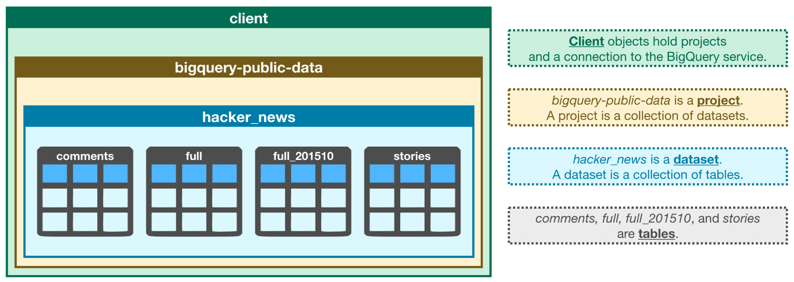

<!-- TOC -->

- [1. Intro to SQL + Advanced SQL](#1-intro-to-sql--advanced-sql)
    - [1.1. Workflow for handling big datasets with BigQuery and SQL](#11-workflow-for-handling-big-datasets-with-bigquery-and-sql)
    - [1.2. Select, From & Where](#12-select-from--where)
    - [1.3. Group By, Having & Count](#13-group-by-having--count)
    - [1.4. Order By](#14-order-by)
    - [1.5. As & With](#15-as--with)
    - [1.6. JOINs and UNIONs](#16-joins-and-unions)
        - [1.6.1. Joining Data](#161-joining-data)
        - [1.6.2. UNIONs](#162-unions)
    - [1.7. Analytic Functions](#17-analytic-functions)
    - [1.8. Nested and Repeated Data (complex datatypes in BigQuery)](#18-nested-and-repeated-data-complex-datatypes-in-bigquery)
        - [1.8.1. Nested data](#181-nested-data)
        - [1.8.2. Repeated data](#182-repeated-data)
        - [1.8.3. Nested and Repeated data](#183-nested-and-repeated-data)
    - [1.9. Writing Efficient Queries](#19-writing-efficient-queries)

<!-- /TOC -->

# Intro to SQL + Advanced SQL
Learn SQL for working with databases, using Google BigQuery to scale to massive datasets.

## Workflow for handling big datasets with BigQuery and SQL
1. fetch the dataset/table by a Client object
```python
from google.cloud import bigquery

client = bigquery.Client() # Create a "Client" object (a central role in retrieving information from BigQuery datasets)

# Using Kaggle's public dataset BigQuery integration.
# In BigQuery, each dataset is contained in a corresponding project. 
dataset_ref = client.dataset("hacker_news", project="bigquery-public-data") # Construct a reference to the dataset ("hacker_news")
dataset = client.get_dataset(dataset_ref) # API request - fetch the dataset
# Every dataset is just a collection of tables. 
tables = list(client.list_tables(dataset)) # List all the tables in the dataset
# Print names of all tables in the dataset (there are four!)
for table in tables:  
    print(table.table_id)    # four tables: 

table_ref = dataset_ref.table("full") # Construct a reference to the "full" table
table = client.get_table(table_ref) # API request - fetch the table (similar to how we fetched a dataset)
```


2. explore the contents of this table 
schema: the structure of a table
```python
table.schema  # Print information on all the columns in the "full" table in the "hacker_news" dataset

# dir(object)   # list all 
[SchemaField('title', 'STRING', 'NULLABLE', 'Story title', ()),
 SchemaField('url', 'STRING', 'NULLABLE', 'Story url', ()),
 SchemaField('text', 'STRING', 'NULLABLE', 'Story or comment text', ())]
```
Each SchemaField tells us about a specific column (i.e. a field). In order, the information is:
- name: the name of the column
- field_type: the field type (or datatype) in the column
- mode: the mode of the column ('NULLABLE' means that a column allows NULL values, and is the default)
- description: a description of the data in that column

3. use the list_rows() method to check the first five lines of of the full table to make sure this is right. 
    (Sometimes databases have outdated descriptions, so it's good to check.) 
    This returns a BigQuery RowIterator object that can quickly be converted to a pandas DataFrame with the to_dataframe() method.
```python
client.list_rows(table, max_results=5).to_dataframe() # Preview the first five lines of the "full" table

client.list_rows(table, selected_fields=table.schema[:1], max_results=5).to_dataframe() # Preview the first five entries in the "by" column of the "full" table (just the information in a specific column)
```

## Select, From & Where
the foundational compontents for all SQL queries
* SELECT ... FROM
    The most basic SQL query selects a single column from a single table. To do this,
    specify the column you want after the word SELECT, and then specify the table after the word FROM.
    - select multiple columns with a comma between the names
    - select all columns with a *
* WHERE ...
    BigQuery datasets are large, so you'll usually want to return only the rows meeting specific conditions.
```python
query = """
        SELECT city
        FROM `bigquery-public-data.openaq.global_air_quality`
        WHERE country = 'US'
        """
query_job = client.query(query) # Set up the query
us_cities = query_job.to_dataframe() # API request - run the query, and return a pandas DataFrame

# Now we've got a pandas DataFrame called us_cities, which we can use like any other DataFrame.
us_cities.city.value_counts().head()  # five cities have the most measurements
```

The triple quotation marks (""") tell Python that everything inside them is a single string, even though we have line breaks in it. The line breaks aren't necessary, but they make it easier to read your query.

No need to capitalize SELECT and FROM, SQL doesn't care about capitalization. However, it's customary to capitalize SQL commands, and it makes the queries easier to read.

- estimate the size of any query before running it
- specify a parameter when running the query to limit how much data you are willing to scan
```python
query = """
        SELECT score, title
        FROM `bigquery-public-data.hacker_news.full`
        WHERE type = "job" 
        """     # Query to get the score column from every row where the type column has value "job"

# Create a QueryJobConfig object to estimate size of query without running it
dry_run_config = bigquery.QueryJobConfig(dry_run=True)
dry_run_query_job = client.query(query, job_config=dry_run_config) # API request - dry run query to estimate costs
print("This query will process {} bytes.".format(dry_run_query_job.total_bytes_processed))

ONE_MB = 1000*1000
safe_config = bigquery.QueryJobConfig(maximum_bytes_billed=ONE_MB) # Only run the query if it's less than 1 MB
safe_query_job = client.query(query, job_config=safe_config) # Set up the query (will only run if it's less than 1 MB)
safe_query_job.to_dataframe() # API request - try to run the query, and return a pandas DataFrame
# InternalServerError, if limit exceeded; the query was cancelled
```

## Group By, Having & Count
* COUNT()
    COUNT() returns a count of things. 
    If you pass it the name of a column, it will return the number of entries in that column.
    COUNT() is an example of an aggregate function, which takes many values and returns one. (Other examples of aggregate functions include SUM(), AVG(), MIN(), and MAX().) Aggregate functions introduce strange column names (like f0__). 
    how to change the name to something more descriptive?

* GROUP BY
    GROUP BY takes the name of one or more columns, and treats all rows with the same value in that column as a single group when you apply aggregate functions. It returns a table with rows (one for each distinct animal).

    SELECT list expression references column (column's name) which is neither grouped nor aggregated at
    - it doesn't make sense to use GROUP BY without an aggregate function. If you have any GROUP BY clause, then all variables must be passed to either a GROUP BY command, or an aggregation function.

3. GROUP BY ... HAVING
    HAVING is used in combination with GROUP BY to ignore groups that don't meet certain criteria.

```python
query_popular = """
                SELECT parent, COUNT(id)
                FROM `bigquery-public-data.hacker_news.comments`
                GROUP BY parent
                HAVING COUNT(id) > 10
                """     # Query to select comments that received more than 10 replies

# run it and store the results in a pandas DataFrame:
safe_config = bigquery.QueryJobConfig(maximum_bytes_billed=10**10) # Set up the query (cancel the query if it would use too much of your quota, with the limit set to 10 GB)
query_job = client.query(query_popular, job_config=safe_config)
 
popular_comments = query_job.to_dataframe() # API request - run the query, and convert the results to a pandas DataFrame
popular_comments.head() # Print the first five rows of the DataFrame
```
Aliasing and other improvements
Aliasing: The column resulting from COUNT(id) was called f0__. That's not a very descriptive name. You can change the name by adding AS NumPosts after you specify the aggregation.

If you are ever unsure what to put inside the COUNT() function, you can do COUNT(1) to count the rows in each group. Most people find it especially readable, because we know it's not focusing on other columns. It also scans less data than if supplied column names (making it faster and using less of your data access quota).


## Order By
use SELECT to pull specific columns from a table, along with WHERE to pull rows that meet specified criteria. You also know how to use aggregate functions like COUNT(), along with GROUP BY to treat multiple rows as a single group

Order your results to focus on the most important data for your use case. 

change the order of your results using the ORDER BY clause, and you'll explore a popular use case by applying ordering to dates

* ORDER BY
    ORDER BY is usually the last clause in your query, and it sorts the results returned by the rest of your query.
    The ORDER BY clause also works for columns containing text, where the results show up in alphabetical order.
    You can reverse the order using the DESC argument (short for 'descending').
* Dates
    There are two ways that dates can be stored in BigQuery: as a DATE or as a DATETIME. 
    - The DATE format has the year first, then the month, and then the day. YYYY-[M]M-[D]D
        YYYY: Four-digit year
        [M]M: One or two digit month
        [D]D: One or two digit day
        So 2019-01-10 is interpreted as January 10, 2019.
    - The DATETIME format is like the date format with time added at the end.

* EXTRACT
    Often you'll want to look at part of a date (DAY/DAYOFWEEK/WEEK/MONTH/YEAR)
    ```python
    query = """
            SELECT Name, EXTRACT(DAY from Date) As Day
            FROM `bigquery-public-data.pet_records.pets_with_date`
            """
    ```

## As & With
Organize your query for better readability. This becomes especially important for complex queries.

* AS
    aliasing: use AS to rename the columns generated by your queries
    To use AS in SQL, insert it right after the column you select.

* WITH ... AS
    On its own, AS is a convenient way to clean up the data returned by your query. It's even more powerful when combined with WITH in what's called a "common table expression".
    
    A **common table expression** (CTE) is a temporary table that you return within your query. CTEs are helpful for splitting your queries into readable chunks, and you can write queries against them.
    Note that CTEs only exist inside the query where you create them, and you can't reference them in later queries. So, any query that uses a CTE is always broken into two parts: create the CTE, and then write a query that uses the CTE.

## JOINs and UNIONs
Combine data sources. Critical for almost all real-world data problems
use JOIN to create a new table combining information from multiple tables.
JOINs horizontally combine results from different tables. UNIONs vertically concatenate columns.

### Joining Data
* JOIN
    Using JOIN, we can combine information from both tables by matching rows where varA column in the A table matches varB column in the B table.
    - INNER JOIN
        ```python
        query = """
                SELECT p.Name AS Pet_Name, o.Name AS Owner_Name
                FROM `bigquery-public-dayta.pet_records.pets` AS p
                INNER JOIN `bigquery-public-dayta.pet_records.owners` AS o
                    ON p.ID = o.Pet_ID
                """
        ```

        In the query, ON determines which column in each table to use to combine the tables. Since the ID column exists in both tables, we have to clarify which one to use. We use p.ID to refer to the ID column from the pets table, and o.Pet_ID refers to the Pet_ID column from the owners table.

        In general, when you're joining tables, it's a good habit to specify which table each of your columns comes from. That way, you don't have to pull up the schema every time you go back to read the query.
        
        INNER JOIN: a row will only be put in the final output table if the value in the columns you're using to combine them shows up in both the tables you're joining
    - LEFT JOIN, RIGHT JOIN: 
        to create a table containing all rows from the owners table, we use a LEFT JOIN. 
        "left" refers to the table that appears before the JOIN in the query. ("Right" refers to the table that is after the JOIN.)

        Replacing INNER JOIN in the query above with LEFT JOIN returns all rows where the two tables have matching entries, along with all of the rows in the left table (whether there is a match or not).

        If we instead use a RIGHT JOIN, we get the matching rows, along with all rows in the right table (whether there is a match or not).
    - RIGHT JOIN: 
        returns all rows from both tables. 
        In general, any row that does not have a match in both tables will have NULL entries for the missing values.

### UNIONs
With a UNION, the data types of both columns must be the same, but the column names can be different.
- use UNION ALL to include duplicate values
- use UNION DISTINCT to drop duplicate values

## Analytic Functions
Perform complex calculations on groups of rows.
Aggregate functions perform calculations based on sets of rows.

Analytic functions operate on a set of rows. However, unlike aggregate functions, analytic functions return a (potentially different) value for each row in the original table.
- Analytic functions allow us to perform complex calculations with relatively straightforward syntax. 
- For instance, we can quickly calculate moving averages and running totals, among other quantities.

Syntax
- All analytic functions have an OVER clause, which defines the sets of rows used in each calculation. 
- The OVER clause has three (optional) parts:
    - PARTITION BY clause:
        divide the rows of the table into different groups. In the query above, we divide by id so that the calculations are separated by runner.
    - ORDER BY clause:
        define an ordering within each partition. In the sample query, ordering by the date column ensures that earlier training sessions appear first.
    - window frame clause:
        It identifies the set of rows used in each calculation. We can refer to this group of rows as a window. 
        (analytic functions are sometimes referred to as (analytic) window functions)
        There are many ways to write window frame clauses:
        - ROWS BETWEEN 1 PRECEDING AND CURRENT ROW - the previous row and the current row.
        - ROWS BETWEEN 3 PRECEDING AND 1 FOLLOWING - the 3 previous rows, the current row, and the following row.
        - ROWS BETWEEN UNBOUNDED PRECEDING AND UNBOUNDED FOLLOWING - all rows in the partition.

Three types of analytic functions (and more)
- Analytic aggregate functions
    Aggregate functions take all of the values within the window as input and return a single value.
    e.g. AVG() is an aggregate function. The OVER clause ensures it's treated as an analytic (aggregate) function. 
    - MIN() (or MAX()) Returns the minimum (or maximum) of input values
    - AVG() (or SUM()) Returns the average (or sum) of input values
    - COUNT() Returns the number of rows in the input
- Analytic navigation functions
    Navigation functions assign a value based on the value in a (usually) different row than the current row.
    - FIRST_VALUE() (or LAST_VALUE()) Returns the first (or last) value in the input
    - LEAD() (and LAG()) Returns the value on a subsequent (or preceding) row
- Analytic numbering functions
    Numbering functions assign integer values to each row based on the ordering.
    - ROW_NUMBER() Returns the order in which rows appear in the input (starting with 1)
    - RANK() All rows with the same value in the ordering column receive the same rank value, where the next row receives a rank value which increments by the number of rows with the previous rank value.

```python
# Query to count the (cumulative) number of trips per day
num_trips_query = """
                  WITH trips_by_day AS
                  (
                  SELECT DATE(start_date) AS trip_date,
                      COUNT(*) as num_trips
                  FROM `bigquery-public-data.san_francisco.bikeshare_trips`
                  WHERE EXTRACT(YEAR FROM start_date) = 2015
                  GROUP BY trip_date
                  )
                  SELECT *,
                      SUM(num_trips) 
                          OVER (
                               ORDER BY trip_date
                               ROWS BETWEEN UNBOUNDED PRECEDING AND CURRENT ROW
                               ) AS cumulative_trips
                      FROM trips_by_day
                  """
# Run the query, and return a pandas DataFrame
num_trips_result = client.query(num_trips_query).result().to_dataframe()
num_trips_result.head()

# The query uses a common table expression (CTE) to first calculate the daily number of trips. Then, we use SUM() as an aggregate function.
# - Since there is no PARTITION BY clause, the entire table is treated as a single partition.
# - The ORDER BY clause orders the rows by date, where earlier dates appear first.
# - By setting the window frame clause to ROWS BETWEEN UNBOUNDED PRECEDING AND CURRENT ROW, we ensure that all rows up to and including the current date are used to calculate the (cumulative) sum. (Note: If you read the documentation, you'll see that this is the default behavior, and so the query would return the same result if we left out this window frame clause.)

# The next query tracks the stations where each bike began (in start_station_id) and ended (in end_station_id) the day on October 25, 2015.
# Query to track beginning and ending stations on October 25, 2015, for each bike
start_end_query = """
                  SELECT bike_number,
                      TIME(start_date) AS trip_time,
                      FIRST_VALUE(start_station_id)
                          OVER (
                               PARTITION BY bike_number
                               ORDER BY start_date
                               ROWS BETWEEN UNBOUNDED PRECEDING AND UNBOUNDED FOLLOWING
                               ) AS first_station_id,
                      LAST_VALUE(end_station_id)
                          OVER (
                               PARTITION BY bike_number
                               ORDER BY start_date
                               ROWS BETWEEN UNBOUNDED PRECEDING AND UNBOUNDED FOLLOWING
                               ) AS last_station_id,
                      start_station_id,
                      end_station_id
                  FROM `bigquery-public-data.san_francisco.bikeshare_trips`
                  WHERE DATE(start_date) = '2015-10-25' 
                  """

# Run the query, and return a pandas DataFrame
start_end_result = client.query(start_end_query).result().to_dataframe()
start_end_result.head()

# The query uses both FIRST_VALUE() and LAST_VALUE() as analytic functions.
# - The PARTITION BY clause breaks the data into partitions based on the bike_number column. Since this column holds unique identifiers for the bikes, this ensures the calculations are performed separately for each bike.
# - The ORDER BY clause puts the rows within each partition in chronological order.
# - Since the window frame clause is ROWS BETWEEN UNBOUNDED PRECEDING AND UNBOUNDED FOLLOWING, for each row, its entire partition is used to perform the calculation. (This ensures the calculated values for rows in the same partition are identical.)
```

## Nested and Repeated Data (complex datatypes in BigQuery)

### Nested data
All of the information from the toys table (multiple columns) is collapsed into a single column. We refer to the "Toy" column in the pets_and_toys table as a nested column, and say that the "Name" and "Type" fields are nested inside of it.

Nested columns have type STRUCT (or type RECORD). 
To query a column with nested data, we need to identify each field in the context of the column that contains it:
- Toy.Name refers to the "Name" field in the "Toy" column
- Toy.Type refers to the "Type" field in the "Toy" column
Otherwise, our usual rules remain the same - we need not change anything else about our queries.

### Repeated data
Now consider the (more realistic!) case where each pet can have multiple toys. In this case, to collapse this information into a single table, we need to leverage a different datatype.

We say that the "Toys" column contains repeated data (mode REPEATED), because it permits more than one value for each row.
Each entry in a repeated field is an ARRAY, or an ordered list of (zero or more) values with the same datatype. 

When querying repeated data, we need to put the name of the column containing the repeated data inside an UNNEST() function.
This essentially flattens the repeated data (which is then appended to the right side of the table) so that we have one element on each row.

### Nested and Repeated data
Now, what if pets can have multiple toys, and we'd like to keep track of both the name and type of each toy? In this case, we can make the "Toys" column both nested and repeated.
In the more_pets_and_toys table above, "Name" and "Type" are both fields contained within the "Toys" STRUCT, and each entry in both "Toys.Name" and "Toys.Type" is an ARRAY.
Since the "Toys" column is repeated, we flatten it with the UNNEST() function. And, since we give the flattened column an alias of t, we can refer to the "Name" and "Type" fields in the "Toys" column as t.Name and t.Type, respectively.

```python
# Query to count the number of transactions per browser
query = """
        SELECT device.browser AS device_browser,
            SUM(totals.transactions) as total_transactions
        FROM `bigquery-public-data.google_analytics_sample.ga_sessions_20170801`
        GROUP BY device_browser
        ORDER BY total_transactions DESC
        """

# Run the query, and return a pandas DataFrame
result = client.query(query).result().to_dataframe()
result.head()
```
By storing the information in the "device" and "totals" columns as STRUCTs (as opposed to separate tables), we avoid expensive JOINs. This increases performance and keeps us from having to worry about JOIN keys (and which tables have the exact data we need).

Now we'll work with the "hits" column as an example of data that is both nested and repeated. Since:
- "hits" is a STRUCT (contains nested data) and is repeated,
- "hitNumber", "page", and "type" are all nested inside the "hits" column, and
- "pagePath" is nested inside the "page" field

```python
# Query to determine most popular landing point on the website
query = """
        SELECT hits.page.pagePath as path,
            COUNT(hits.page.pagePath) as counts
        FROM `bigquery-public-data.google_analytics_sample.ga_sessions_20170801`, 
            UNNEST(hits) as hits
        WHERE hits.type="PAGE" and hits.hitNumber=1
        GROUP BY path
        ORDER BY counts DESC
        """

# Run the query, and return a pandas DataFrame
result = client.query(query).result().to_dataframe()
result.head()
```

## Writing Efficient Queries
Write queries to run faster and use less data.

What about queries that will be run many times, like a query that feeds data to a website? Those need to be efficient so you don't leave users waiting for your website to load. Or what about queries on huge datasets? These can be slow and cost a business a lot of money if they are written poorly.

Most database systems have a **query optimizer** that attempts to interpret/execute your query in the most effective way possible. But several strategies can still yield huge savings in many cases.

functions to compare the efficiency of different queries:
- show_amount_of_data_scanned() shows the amount of data the query uses.
- show_time_to_run() prints how long it takes for the query to execute.

Strategy 1. Only select the columns you want.
    It is tempting to start queries with SELECT * FROM .... It's convenient because you don't need to think about which columns you need. But it can be very inefficient.

Strategy 2. Read less data.
    Both queries below calculate the average duration (in seconds) of one-way bike trips in the city of San Francisco.
```python
more_data_query = """
                  SELECT MIN(start_station_name) AS start_station_name,
                      MIN(end_station_name) AS end_station_name,
                      AVG(duration_sec) AS avg_duration_sec
                  FROM `bigquery-public-data.san_francisco.bikeshare_trips`
                  WHERE start_station_id != end_station_id 
                  GROUP BY start_station_id, end_station_id
                  LIMIT 10
                  """
show_amount_of_data_scanned(more_data_query)

less_data_query = """
                  SELECT start_station_name,
                      end_station_name,
                      AVG(duration_sec) AS avg_duration_sec                  
                  FROM `bigquery-public-data.san_francisco.bikeshare_trips`
                  WHERE start_station_name != end_station_name
                  GROUP BY start_station_name, end_station_name
                  LIMIT 10
                  """
show_amount_of_data_scanned(less_data_query)

# Data processed: 0.076 GB
# Data processed: 0.06 GB
```
Since there is a 1:1 relationship between the station ID and the station name, we don't need to use the start_station_id and end_station_id columns in the query. By using only the columns with the station IDs, we scan less data.

Strategy 3. Avoid N:N JOINs.
    Most of the JOINs that you have executed in this course have been 1:1 JOINs. In this case, each row in each table has at most one match in the other table.
    
    Another type of JOIN is an N:1 JOIN. Here, each row in one table matches potentially many rows in the other table.

    An N:N JOIN is one where a group of rows in one table can match a group of rows in the other table. In general, all other things equal, this type of JOIN produces a table with many more rows than either of the two (original) tables that are being JOINed.